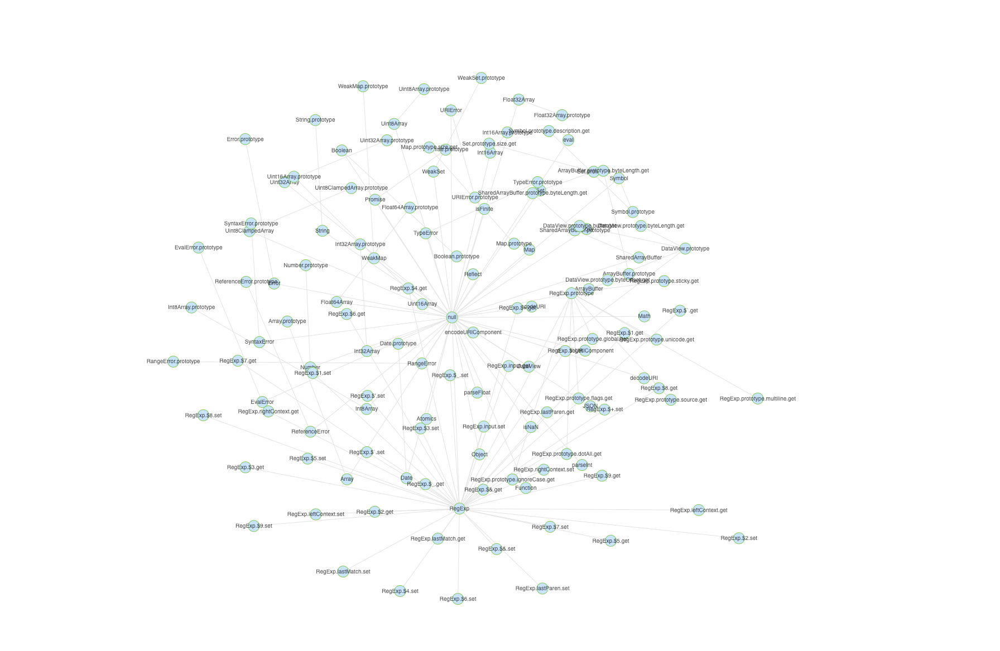

# Relation
 list relation for all objects in realm with G6

## Screenshot


## How to start


```code
npm install

or

yarn install
```
then
```code
npm run start

or

yarn start
```
or

> open [test.html](./test.html) in your local browser


## License

Relation is released under the MIT license.
